# 🤝 Contributing to dev-mcp

First off, thank you for showing interest in contributing to **`dev-mcp` (AI Engineering Operating System)**! 

This document outlines the architecture, code standards, setup guides, and contribution guidelines to help you get started quickly.

---

## 👥 Lead Maintainer Contact Info

For questions, community syncs, or active partnerships, feel free to reach out to the project founder:

* **Name:** Pranjal Yadav
* **Email:** [2k24.cs1l.2410719@gmail.com](mailto:2k24.cs1l.2410719@gmail.com)
* **Phone:** +91 9219920362
* **LinkedIn:** [linkedin.com/in/-pranjal22/](https://www.linkedin.com/in/-pranjal22/)
* **GitHub Profile:** [github.com/pranjal2410719](https://github.com/pranjal2410719)
* **Project Repository:** [github.com/pranjal2410719/dev-mcp](https://github.com/pranjal2410719/dev-mcp)

---

## 📐 Architecture Overview & Module Layout

The codebase of `dev-mcp` is cleanly separated into three layers: **Core**, **Tools**, and **Brain**.

```mermaid
graph TD
    server[server.py Entry Point] --> app[app.py FastMCP Instance]
    server --> tools[tools/ Generic Tools]
    server --> brain[brain/ Specialized PM Engines]
    server --> prompts[prompts/ Definitions]
    server --> resources[resources/ Definitions]
    
    app --> context[context.py ProjectContext]
    app --> security[security.py validate_path]
    
    tools --> file_ops[file_ops.py]
    tools --> search[search.py]
    tools --> git_ops[git_ops.py]
    tools --> terminal[terminal.py]
    tools --> context_mgmt[context_mgmt.py]
    
    brain --> prd[prd_manager.py]
    brain --> phase[phase_manager.py]
    brain --> todo[todo_engine.py]
    brain --> handoff[handoff_engine.py]
    brain --> orchestrator[orchestrator.py]
    brain --> guardian[guardian.py]
    brain --> dep[dependency.py]
    brain --> sync[sync_engine.py]
    brain --> reqs[requirements.py]
    brain --> readiness[project_readiness.py]
```



### 1. Core Layer
* **[server.py](file:///home/dev/Desktop/projects/mcp/dev-mcp/server.py)**: The main execution script. It imports the FastMCP instance, triggers all tool registration imports, and boots the stdio event loop (`mcp.run()`).
* **[app.py](file:///home/dev/Desktop/projects/mcp/dev-mcp/app.py)**: Manages shared server state, registers the `dev-mcp` server, and hosts the context loader (`load_context`). The loader is designed to prevent cross-project state leakage by checking if the requested directory differs from the cached instance.
* **[context.py](file:///home/dev/Desktop/projects/mcp/dev-mcp/context.py)**: Implements the `ProjectContext` class, which manages key-value store transactions against `.project-context.json` using dot-notation, handles defaults, and generates markdown reports for LLM clients.
* **[security.py](file:///home/dev/Desktop/projects/mcp/dev-mcp/security.py)**: The security controller. Sanitizes paths and validates them against allowed sandboxed folders (CWD, home directory `$HOME`, or user-specified directories in `DEV_MCP_ALLOWED_DIRS`) to prevent directory traversal exploits.

### 2. Tools Layer (Generic)
Stateless utility wrappers exposing standard operating system functions to the LLM:
* **[tools/file_ops.py](file:///home/dev/Desktop/projects/mcp/dev-mcp/tools/file_ops.py)**: Handles sandboxed file manipulation (read, write, edit, delete, directory listing, mkdir, glob).
* **[tools/search.py](file:///home/dev/Desktop/projects/mcp/dev-mcp/tools/search.py)**: Ripgrep-based code pattern search with a robust, pure-Python fallback search if `rg` is not installed on the system.
* **[tools/terminal.py](file:///home/dev/Desktop/projects/mcp/dev-mcp/tools/terminal.py)**: Safely runs local terminal commands with strict timeouts.
* **[tools/git_ops.py](file:///home/dev/Desktop/projects/mcp/dev-mcp/tools/git_ops.py)**: Operates local Git repositories (status, diffs, checkout branch, add, commit, branch creation).
* **[tools/context_mgmt.py](file:///home/dev/Desktop/projects/mcp/dev-mcp/tools/context_mgmt.py)**: Direct getters and setters to query, modify, add, and remove records in `.project-context.json`.

### 3. Brain Layer (Project Operating System)
Specialized PM algorithms driving the AI development lifecycle:
* **[brain/project_readiness.py](file:///home/dev/Desktop/projects/mcp/dev-mcp/brain/project_readiness.py)**: Evaluates codebase maturity (Levels 0-5), implements onboarding/migration generators (`bootstrap_project` and `adopt_existing_project`), runs diagnostics (`doctor`), and manages safe resets/archives.
* **[brain/orchestrator.py](file:///home/dev/Desktop/projects/mcp/dev-mcp/brain/orchestrator.py)**: Manages developer sprints (`start_session` and `end_session`), suggests conventional commit messages, and calculates dashboard recommendations.
* **[brain/todo_engine.py](file:///home/dev/Desktop/projects/mcp/dev-mcp/brain/todo_engine.py)**: Implements structured JSON task backlogs with phase bounds, priority weights, and task dependency blocks.
* **[brain/phase_manager.py](file:///home/dev/Desktop/projects/mcp/dev-mcp/brain/phase_manager.py)**: Scopes current target work through sequential phases (planning, implementation, alpha, beta) and tracks release milestones.
* **[brain/prd_manager.py](file:///home/dev/Desktop/projects/mcp/dev-mcp/brain/prd_manager.py)**: Writes, updates, and compares Product Requirements Documents (PRDs).
* **[brain/requirements.py](file:///home/dev/Desktop/projects/mcp/dev-mcp/brain/requirements.py)**: Extracts specifications into keywords, generates a requirements matrix, and maps requirements implementation percentage.
* **[brain/sync_engine.py](file:///home/dev/Desktop/projects/mcp/dev-mcp/brain/sync_engine.py)**: Matches physical files, Git logs, and active branch names to automated tasks, compiling reality verification confidence dossiers.
* **[brain/handoff_engine.py](file:///home/dev/Desktop/projects/mcp/dev-mcp/brain/handoff_engine.py)**: Formulates session summaries into files under `.project_brain/handoffs/` for seamless model transitions.
* **[brain/guardian.py](file:///home/dev/Desktop/projects/mcp/dev-mcp/brain/guardian.py)**: Enforces technology constraints by scanning imports against forbidden technologies (e.g. banning `firebase` or `redux`).
* **[brain/dependency.py](file:///home/dev/Desktop/projects/mcp/dev-mcp/brain/dependency.py)**: Parses language imports to construct dependency graphs and conducts downstream impact analysis (blast radius audits).

---

## 🛠️ Developer Setup & Implementation Guide

### 1. Clone & Environment Setup
Clone the repository and set up a virtual environment using `uv` (recommended) or standard `venv`:

```bash
# Clone the repository
git clone https://github.com/pranjal2410719/dev-mcp.git
cd dev-mcp

# Setup environment via uv (recommended for speed)
uv venv
source .venv/bin/activate
uv pip install -e .

# OR using standard python venv
python3 -m venv .venv
source .venv/bin/activate
pip install -e .
```

### 2. Standard Code Conventions
* **Typing:** Fully-typed python signatures are required. Enable type annotations at module scopes.
* **Imports:** Sort imports alphabetically. Brain submodules must use absolute module references (e.g., `from app import mcp`, `from security import validate_path`).
* **Error Handling:** Never swallow exceptions. Standardize logs, raise specific exceptions (like `FileNotFoundError` or `ValueError`), and print detailed error logs.
* **Docstrings:** Docstrings must be clean, descriptive, and list all parameters and return types. **Important:** FastMCP uses your python function docstrings and type hints to dynamically compile the JSON schema definitions sent to AI clients. Keep them comprehensive!

### 3. How to Register a New Tool
To register a new tool, define it within a module and annotate it using the `@mcp.tool` decorator:

```python
# In tools/my_helper.py

from app import mcp
from security import validate_path

@mcp.tool(description="A helpful description detailing what this tool does.")
def calculate_something(param1: str, path: str = ".") -> str:
    """Calculate something useful in a validated directory.

    Args:
        param1: Clarifying parameter.
        path: Path to validate.
    """
    valid_path = validate_path(path)
    # Perform logic...
    return "Result summary"
```

Next, register your module by importing it inside `server.py` so it initializes during server boot:
```python
# In server.py
import tools.my_helper  # noqa: F401
```

### 4. Running the Validation Pipeline
Make sure to validate your changes before pushing them. The repository includes an E2E accuracy validation script that simulates onboarding, PRD requirements tracing, Git workflow commits, and sync engines:

```bash
.venv/bin/python tests/validate_mcp_flow.py
```

All contributions must pass these pipeline tests before submitting a Pull Request.

### 5. Hot Reloading & Client Reconnections
When editing tools or modifying server code, the active stdio pipe cached by your AI Client (e.g., Cursor, Claude Desktop) will go out of sync or throw EOF errors. 

Make sure to restart the MCP server in your client settings to force-load your modifications:
* **Cursor:** Settings → Features → MCP → click **Restart** on `dev-mcp`.
* **Claude Desktop:** Fully **Quit** the app and reopen it.
* **Cline / Roo Code:** Restart the extension or run `/mcp restart dev-mcp`.

---

## 🚀 Contribution Pipeline

1. **Fork the repo** on GitHub.
2. **Create a feature branch** (`git checkout -b feature/amazing-tool`).
3. **Write your feature** and add relevant tests.
4. **Run `python tests/validate_mcp_flow.py`** to ensure validation passes.
5. **Format your code** using standard formatting guidelines.
6. **Commit changes** using Conventional Commits style (e.g., `feat(search): add fuzzy search matching`).
7. **Submit a Pull Request** to the `main` branch.
